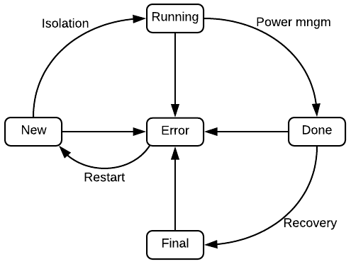

# Node remedy
@ybronhei @jchaloup
February 2018

## Proposal and Motivation
Applying remedy plugin mechanism to cluster nodes which provides instructions to isolate resources and repair issues. The feature will provide way to set node event conditions that remedy controller will detect. On detection remidiation pod will be executed. Remidation pod will take care to isolate the node from cluster. Remedy pod contains the service-account to execute Ansible playbook with instructions such as [node drain](https://kubernetes.io/docs/tasks/administer-cluster/safely-drain-node/), node conrdon, power-management actions, detaching from storage and network disconnection.

Isolating node is importent to provide HA guarantees.  [pod-safety](https://github.com/kubernetes/community/blob/16f88595883a7461010b6708fb0e0bf1b046cf33/contributors/design-proposals/pod-safety.md) describes the motivation behind the guarantee to only one execution of a particular pet pod at any time on the cluster. Pet pod must run once to avoid data corruption and keep their consist state. 
 
## Remedy detector
All the cloud provider and bare-metal specific knowledge and implementation are delegated into remediation pod. This way, each operator that has a specific knowledge and expertise of affected environment can provide his/her own solutions. Given a specific auto-repairing mechanism is shipped in a container image, it is also easier to update and test individual pieces without a need to update the controller itself. Also, the open-source community provides a lot of functioning solutions that can be used.

Admin will need to create configmaps for all parameters required to run the remedation:
 - specific configuration tailored for each node (bare-metal providers require more parameters to perform power-management operations)
 -  credentials management needed to perform cloud specific operations (delegating the responsibility to an operator for figuring out the way to provide credentials)
 - SSH keys management (the keys can be read from a specific URL that is available only on a specific subnet)
specific configuration tailored for each node (bare-metal providers require more parameters to perform power-management operations)

Those will be accessable to the remedation pod to execute the defined flow.

Each node auto isolation operation is modeled as a sequence of transitions between states (e.g. bad node detected, node queued, node isolated), each transition possibly triggering a remedy action or cluster cleaning. E.g. transition from node queued to node isolated can trigger network isolation and resource cleaning.

**Example**: when a node problem detector reports crashes of applications due to unaccessible AWS volume the remedy monitor may:

```
1. Mark node unschedulable
2. Detach the AWS volume (in case it is attached) or fence mounted storage
3. Remove resources to allow scheduler to re-run them if posible
4. Restart a node
5. Mark the node schedulable again
```
In case a node remedy operation is interrupted (monitor crash, failed to reach api or device etc), we need a reliable way to store the last state of the operation so the remedy flow can be resumed and reported as done.

Running pod remidation will include also signing the node by annotations for the remidation-timestamp and remidation-podname, so on monitor crash, new instance will be able to monitor all running remidation pods.

## Deployment
We want to cover isolation (storage-fence, cluster isolation) and power-management (rebooting the node’s machine) actions while node is partitioned from cluster until it becomes responsive again. 

As the main purpose of the remedy is to release pet pods of partitioned node, remove resources is very critical part of the remedy instructions.

User defines node-remedy configuration for evert node type: 

```yaml
apiVersion: node-remedy/v1alpha
kind: Configuration
# optional node selector (type=compute, type=accelerated, type=storage-optimized, type=bare-metal)
nodeSelector: type=compute
# list of thresholds tracked, and the remedy to execute if triggered
# note: you could track many node conditions other than ready
thresholdConfigs:
- nodeConditionType: Ready
  nodeConditionStatus: false
  nodeConditionPeriod: 5s
  remedy1: 
   - name: repair   
   - period: 3m
  remedy2: 
   - name: terminate
   - clean-resourece: true
  recovery:
   - name: recovery
- nodeConditionType: DiskPressure
  nodeConditionStatus: true
  nodeConditionPeriod: 10m
  remedy1:
   - name: storage-fence
   - clean-resourece: true
  recovery:
   - name: recovery

# users may create remedies for any number of things that could happen to a node
# the tool only cares if the configured job runs to success or failure
remedyConfigs:
# the repair remedy that in this case says run a job that executes a command to clean node
# the pod template should assume standard input via downward api that describes what node is being remedied
- name: repair
  podTemplate:
   spec:
    containers:
    - name: repair
      image: IMAGE:VERSION
      command: [ "binary", "clean node command" ]
      env: ["secret-key"]
      configmaps: ["fence-method-config"]
    restartPolicy: Never
# the terminate remedy that in this case says run a job that executes a command to terminate node
- name: terminate
  podTemplate:
   spec:
    containers:
    - name: terminate
      image: IMAGE:VERSION
      command: [ "binary", "terminate node command" ]
    restartPolicy: Never
```

Cloud providers such as AWS or GCE expose a cloud API through which a remedy action can be performed. In most cases only credentials to the cluster and an instance name are required to access the cloud provider API. Over bare-metal cluster, an API provider requires knowledge of hardware specific parameters (e.g Eaton PDU parameters to perform power management actions or switch brocade parameters to disconnect a node from the network).

### Bare-metal configmaps
The node fence configuration could be specified as:

```yaml
- kind: ConfigMap
  apiVersion: v1
  metadata:
   name: fence-config-[NODE_NAME]
  data:
   config.properties: |-
    node_name=[NODE_NAME]
    isolation=fc-off
    power_management=eaton-off eaton-on
    recovery=fc-on
   fence-method-fc-on: |-
    template=fence-method-template-fc-switch-brocade
    plug=2
    action=on
   fence-method-fc-off: |-
    template=fence-method-template-fc-switch-brocade
    plug=2
    action=off
   fence-method-eaton-on: |-
    template=fence-method-template-eaton-pdu
    plug=1
    action=on
   fence-method-eaton-off: |-
    template=fence-method-template-eaton-pdu
    plug=1
    action=off
```

The fence node configuration file centralizes the information about “how” the node can be “fenced” from the cluster.
In general, it consists of 3 fencing steps: “isolation”, “power-management” and “recovery”.
Each step specifying a sequence of methods.
Each fence method is an instance of a fencing template that allows to reuse parameters for common devices.
Check [examples](node-fencing-examples) to see some of the templates.

### Remedy pod
To address this pods that in the event of a node-level failure, the pod will run isolatation flow to the affected node
and notifies the apiserver that it is safe to continue recovery.

This functionality, if configured by the admin, is absolutely necessary for nodes running
StatefulSets as they are currently the only construct that provides at-most-one
semantics for its members.  In the absence of this feature, an end-user has no ability
to safely and/or reliably allow StatefulSets to be recovered and as such end-users
will not be provided with a mechanism to enable/disable this functionality on a set-by-set basis.

Depending on the deployment, the fencing executors will have capabilities such as:
* Power management fencing: powering off\on\rebooting a node
* Storage fencing: disconnection from specific storage to prevent multiple writers, and unfence when connectivity is restored
* Cluster fence: Cordon node, removing node workload from apiserver

Once the node has been made safe/isolated by using one or more of the fencing mechanisms listed above,
we can know that either the pods are not running anymore or they are not accessing shared
resources (storage or network) and we can safely delete their objects from the apiserver
to allow the scheduler to initiate new instance.

The design and implementation acknowledge that other entities, such as the autoscaler,
are likely to be present and performing similar monitoring and recovery actions.
Therefore it is critical that the fencing controller does not create or be is not susceptible to race conditions.

### Bare-metal Remedy Pod - Fence
The fence controller is stateless and manipulate state automaton flow. 
The controller identifies unresponsive node by getting events from the apiserver.
Once the node misbehaves (e.g. becomes “not ready”) the controller initiates a fence flow.

The controller is defined as a n-tuple (S, T, r, new, F), where `S` denotes a set of states,
`T` a set of fence steps, `r` stands for a transition function, ``new`` is its initial state
and ``F`` a set of final states.

The set `S` consists of:

* ``new``: a node gets into the state in a moment it starts misbehaving (e.g. node reporting `Unready` status)
* ``running``: a node is isolated and ready for power management actions
* ``done``: a node is ready for recovery
* ``final``:  node is repaired and joined back to the cluster
* ``error``: either of the fence steps failed

The transition function ``r`` is defined as:

* When a node is in the ``new`` state for a specified number of times units,
the ``isolation`` step is triggered. Once the step is completed,
the node transitions to the ``running`` state. In case the step is not completed,
the node transitions to the ``error`` state.

* When a node is in the ``running`` state, check if the node status is ``Ready``.
If it is, node transitions to the ``done`` state.
Otherwise the ``power-management`` step is triggered.
If the step fails, the node transitions to the ``error`` state. Otherwise
the node transitions to the ``done`` state.

* When a node is in the ``done`` state, check the node status. If the status is
``Ready``, run the ``recovery`` step. Otherwise, transition to the ``error`` state.
If the ``recovery`` step is completed, move the the ``final`` state. Otherwise,
transition to the ``error`` state.

If a fence step fails, it can be retried a configurable number of times before
the node transitions into the ``error`` state.

If a node gets into the ``error`` state, entire fencing flow is restarted and the
node is moved to the ``new`` state. The number of restarts is configurable as well.

| Fence controller state transitions |
|:--:|
|  |

TODO: add arrows (if node ready -> move to done)
TODO: Q- The fence controller(s) should run on the master nodes (as it is more secure).

#### Fence CRD
This is new proposed crd object in k8s cluster API server. The idea behind is:

1. to allow the fence controller to be “stateless” - means that the crd will hold the fence operation state and if controller was restarted all the info to continue fence operation will be specified in those objects.
1. to allow triggering jobs to perform actions and sign if they finished successfully or failed.

```yaml
apiVersion: ha.k8s.io/v1
jobs:
- gcloud-reset-inst-9cf8f46e-f44b-11e7-8977-68f728ac95ea
- clean-pods-9d0b1321-f44b-11e7-8977-68f728ac95ea
kind: NodeFence
metadata:
  clusterName: ""
  creationTimestamp: 2018-01-08T08:11:03Z
  generation: 0
  name: node-fence-k8s-cluster-host1.usersys.redhat.com
  namespace: ""
  resourceVersion: "163898"
  selfLink: /apis/ha.k8s.io/v1/node-fence-k8s-cluster-host1.usersys.redhat.com
  uid: 77fdb386-f44b-11e7-bec9-001a4a16015a
node: k8s-cluster-host1.usersys.redhat.com
retries: 2
status: Done
step: Power-Management
```
- step can be isolation\power_managment\recover - this refer to the set of methods configured in the node fence configuration.
- status is new, done, running, final or error - see Fence Controller management for each status.

Flow example: controller saw non-response node and created new crd to fence the new, this initialized to “step: isolation” and current timestep. The controller create jobs related to the step and move status to running.
- If node becomes “ready” in cluster, controller will change the crd to step:recovery and start triggering recovery jobs.

After 5min (configurable) if node is still “not ready” controller will change to step:power_managment and status:new to start triggering pm jobs.

### Cloud Provider Remedy Pod
In any case, complexity of running a single remediation podaction should be hidden
in specific implementation so the remedy monitor is independent of a provider
and it is easy to extend the list of supported cloud providers with new ones.

Currently, the following cloud providers are identified:
* AWS
* GCE
* OpenStack
* Azure
* WmWare

NOTE: the list is not to be a complete enumeration of all available providers

Each remedy pod needs to know how to access a specific cloud provider API and
what parameters are needed to perform selected action.
There are multiple ways how to provide such parameters to each agent.
Either to specify per node configuration that each agent can read or
to read all the parameters from a centralized location and inject them into
fence agent. In either case we need to minimize the agent configuration
complexity.

By default, there is no explicit configuration needed.
It is assumed only cloud provider credentials and a node instance name
are required. In case more parameters are needed to perform a fencing action,
they can be set in the fence controller configuration (in case they are common
for all nodes) or via ``ConfigMap`` for a specific node (or a set of nodes).

In our proposal each fencing action is implemented as a sequence of fencing
methods (e.g. restart AWS instnace, turn PDU on/off, network switch on/off).

In the default case (e.g. for AWS), the configuration could look like:

```yaml
- kind: ConfigMap
  apiVersion: v1
  metadata:
   name: fence-config-[NODE_NAME]
  data:
   config.properties: |-
    node_name=[NODE_NAME]
    isolation=mark-unschedulable
    power_management=restart-instance
    recovery=mark-unschedulable
```

Given this configuration is default, it does not have to be specified at all.
Though it can be overrided by a specific one.

## Pet pods
Kubernetes cluster can get into a network partition state between nodes to the apiserver
running on the master node (e.g. network device failure).
When that happens their nodes’ status is changed to “not ready” by the node controller
and the scheduler cannot know the status of pods running on that node without reaching
the nodes’ kubelet service. From such scenario, k8s (since 1.8) defines an eviction timeout
(forced by the node controller) such that after 5 minutes pods will enter a termination
state in the apiserver and will try to shutdown gracefully when possible (this happens
only if the connectivity returns).

If the pod belongs to a ReplicaSet, once the termination state is set, the ReplicaSet
controller will immediately start another instance of that pod.
However when the pod is part of a StatefulSet, the StatefulSet controller won’t start
new instance of that pod until the kubelet responds with the pod’s status.
This is because there is a permanent association between a StatefulSet member and
its storage. Not waiting would potentially result in multiple copies of a member,
all writing to the same volume (leading to corruption or worse).

TODO: a pod needs an AWS volumes which claims it mounted on a node but it is actually not.
So we need to restart the node so the volume is properly detached from the node
and can be properly attached on a different node.

TODO: node resource consumed by a node daemon or a container runtime environment may
grow over time without any visible reason (e.g. faulty garbage collector in Go runtime environments
or a container runtime environment loosing a memory/not releasing i-nodes) which can
eventually exhaust some of the available resource causing a node to be inoperable.
Restarting a node can help to re-claim the resources.

## User experience
The loss of a worker node should be transparent to user's of StatefulSets. Recovery time for affected Pods should be bounded and short, allowing scale up/down events to proceed as normal afterwards.

In the absence of this feature, an end-user has no ability to safely or reliably allow StatefulSets to be recovered and as such end-users will not be provided with a mechanism to enable/disable this functionality on a set-by-set basis.

### Use Cases
1. In a bare metal Kubernetes deployment, StatefulSets should not require admin intervention in order to restore capacity when a member Pod was active on a lost worker
1. In a bare metal Kubernetes deployment, StatefulSets should not require admin intervention in order to scale up or down when a member Pod was active on a lost worker
1. In a Cloud Kubernetes deployment, StatefulSets without an autoscaler should not require admin intervention in order to scale up or down when a member Pod was active on a lost worker
1. Pods on a node providing HA services can suffer from a network malfunction caused be an incorrectly functioning
network utilities on a node. Rebooting a node allows to re-schedule the pods safely.

In other words, the failure of a worker node should not represent a single point of failure for StatefulSets.

## Admin experience
we can see a set of nodes as a set of containers. Each time an application crushes or a running process makes underlying container un-operable, the container is restarted or recreated. We want the same to be done for the nodes. Each time there is an issue causing a node to misbehave, we need to perform suitable actions so the node is forced back to conforming behavior automatically without a SRE intervention.

Operational view around node management will be logged to cluster events and presented in management console (e.g cockpit). The status of fence operations will be followed and managed by the admin. Admin will be able to force stop of fencing operation and fix manually problems.
In addition, problem events counter will be integrated. This allows to monitor issues and their handling in operated cluster. Alarms can be set when issues repeated in certain period that the admin configures (e.g. if one pod causes hardware crashes, this monitoring view will provide overview of the cause that can be fixed manually).

### Cluster remedy policies
Remedy policy allows each cluster to behave differently in case of connectivity issues.
One of the main motivation for that is to prevent “fencing storms” from happening,
but there are others. The controller is responsible for forcing the fence policy.

Fencing storm is a situation in which fencing for a few nodes in the cluster
is triggered at the same time, due to an environmental issue.

Some ways to prevent fencing storms:
* Skip fencing if select % of hosts in cluster is non-responsive (will help for issue #2 above)
* Skip fencing if detected the host cannot connect to storage.

**Examples**:

1. Switch failure - a switch used to connect a few nodes to the environment is failing,
and there is no redundancy in the network environment. In such a case,
the nodes will be reported as unresponsive, while they are still alive and kicking,
and perhaps providing service through other networks they are attached to.
If we fence those nodes, a few services will be offline until restarted,
while it might not have been necessary.

2. Management system network failure - if the management system has connectivity issues,
it might cause it to identify that nodes are unresponsive,
while the issue is with the management system itself.

3. In some cases the AWS volume can not be dettached or only some of the affected pods can be
deleted (e.g. due to disruption budget limitations). Thus, some fence policies may be applied:
* Limit the number of resources (e.g. pods) deleted per unit of time
* Respect disruption budget (e.g. remove the pods from a node via the proper endpoint) (NOTE: this may be already implemented in the Delete request)
* Process only one node at a given time to minimize disruption of the cluster (e.g. in case other nodes are still providing services)


### Pods treatment
Pod treatment is done by “cluster fence agents” which will be run as part of a node fence treatment.

Kubernetes follows taint-based-evictions. Taints and tolerations are ways to steer pods from nodes or evict pods that should stop.
Pods states are changed once fence flow starts. Therefore, manual status change needs to be done:
Fence pods treatment rules:
- If storage fence was performed, all pods that used this storage can be deleted from the api server.
- If power management for reboot the node ran - all node resources can be removed from cluster.

In contrast to the autoscaler, the fence controller cannot control the re-scheduling load once a node is fenced (on scale down their controller gracefully treat the pods liveness). All resources are released at once, which can lead to overload and scale issues, which happens in parallel to the fence operation.

Default node controller eviction policy doesn’t interfere with this logic. Evictions set the pod for terminating state until node is responsive to perform graceful shutdown. In pod treatment agents we will delete the pods’ objects only if the node does not get to ready and fenced. This action can trigger autoscaler to scale up the cluster when big overload is removed from specific node and immediately rescheduled.

In power management fencing we usually expect the machine to come up again and re-join to the cluster. Therefore, we do not clean the node object, but leave it in “not ready” state bounded until connectivity is returned.

Note: A fencing method can also remove the node from the cluster using the cloud provider API if configured.

## To consider

### Node problem detector

Daemon which runs on each node, detects node problems and reports them to apiserver.
The project lives under [https://github.com/kubernetes/node-problem-detector/](https://github.com/kubernetes/node-problem-detector/) repository.
The node problem reports can be used to detect different misbehavior than just node going into "Unready" status.

### Kdump integration
When kdump enabled is set in node fence configuration the controller can check
for kdump notifications once node becomes not ready. Once dumping is recognized,
we can delete all pods.
In parallel to waiting for kernel dumping the controller will start executing
fence stage normally (admin should take care of configuring PM method to run after
enough timeout to let the dumping finish).
Kernel dumping is done by booting up node to kdump kernel that starts dumping
to hard-coded fqdn reachable in cluster that save the dumping data.

### Alternatives considered
1. Create a new Cloud Provider allowing the autoscaler to function for
   bare metal deployments.

   This was considered however the existing APIs are load balancer
   centric and hard to map to the concept of powering on and off nodes.

   If the Cloud Provider API evolves in a compatible direction, it
   might be advisable to persue a Bare Metal provider and have it be
   responsible for much of the fencing configuration.

1. A solution that focused exclusively on power fencing.

   While this would dramatically simplify the configuration required,
   many admins see power fencing as a last resort and would prefer
   less destructive way to isolate a misbehaving node, such as network
   and/or disk fencing.

   We also see a desire from admins to use tools such as `kdump` to
   obtain additional diagnostics, when possible, prior to powering off
   the node.

1. Attaching fencing configuration to nodes.

   While it is tempting to add details on how to fence a node to the
   kubernetes Node objects, this scales poorly from a maintenance
   perspective, preventing nodes from sharing common methods (such as
   `kdump`).

   This is especially true for cloud deployments where all nodes are
   controlled with the same credentials. However, even on bare metal
   the only point of differention is often the the IP addresses of the
   IPMI device, or the port number for a network switch, and it would
   be advantageous to manage the rest in one place.

### Roadmap

Underway:

* Implement remedy monitor - defining configuration structure.
* fence flow mechanism (state automaton) over GCE - using types configs
* Implement the fence flow mechanism using fence agents for bare-metal support (focus on 1 or 2 PM devices)
This will allow to demo full roll-out on cloud environments and bare-metal.

Would like to get soon:

* CI tests
* Demonstrate the fencing mechanism on AWS and GCE (optionally OpenStack)
* Generate metrics based on the fence flow
* Per set-of-nodes fencing configuration
* Cluster fence policies applied

Other possibilities:

* Consume events from the [Node problem detector](https://github.com/kubernetes/node-problem-detector)
* Consume events/data from other source providing information about node behavior
